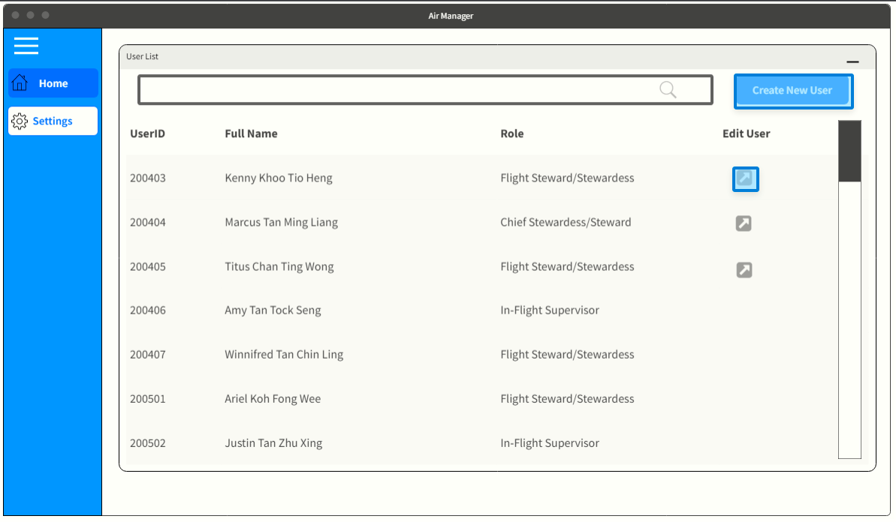

# ✈️ Air Manager ✈️

## Introduction 

Air Manager is a work allocation system for airline cabin crews to plan their weekly work schedules and for the airline company to ensure that the required number of personnel are assigned to each airline fleet.

Air Manager will allow cabin crew to indicate their availability before work allocation is assigned. Managers will then be able to view and assign the cabin crew according to the airline fleet.  The purpose of this software is to allow all employees to manage their working hours and ensure that all working hour regulations are adhered to.

<br>
<br>

# Prototype Usage
**Prototype Link:** <br>
https://marvelapp.com/prototype/j3265b1 <br>
*Note that there could be sizing issues when viewing the prototype, which can easily be fixed by zooming in on the browser. <br>

**Prototype Video:** <br>
``` View the "Prototype Demo.mp4" attached to the repository ```

<br>

Clicking anywhere on the screen will highlight all of the clickable elements in the prototype in blue. 



You can also move on to the next screen by moving your mouse to the left/right side of the screen and clicking on the arrow button.


You can also view all screens in the prototype by pressing "h" or clicking on the following button in the menu found on the bottom right.


<br>
<br>

# Prototype Page Reference
## <u> Admin pages </u>
The first section of the prototype showcases the admin page's features, and is contained within screens 1-6. 
- Page 1: Admin dashboard
- Page 2: Account details edit page
- Page 3-6: User creation

## <u> Login page </u> 
The first section of the prototype showcases the admin page's features, and is contained within screens 7-10. 
- Page 7: Login screen
- Page 8-9: MFA registration and password creation (Only for first time login users!)
- Page 10: MFA code entry page (For subsequent logins)

## <u> Manager pages </u> 
The first section of the prototype showcases the admin page's features, and is contained within screens 11-27. 
- Page 11: Manager dashboard
- Page 12: View manager notifications
- Page 13: Manager Flight Management page
- Page 14-16: Seat row management, assigning a staff to row assignment
- Page 17-19: Flight management, assigning staff to flight
- Page 20-25: Staff management, viewing staff availability and reassigning staff to flight
- Page 26: Manager Flight page
- Page 27: Manager Staff page

## <u> Staff pages </u>
The first section of the prototype showcases the admin page's features, and is contained within screens 28-38. 
- Page 28: Staff dashboard
- Page 29: View staff notifications
- Page 30: Staff view upcoming job
- Page 31: Staff indicate preference for upcoming job
- Page 32-35: Staff job assignment rejection
- Page 36-38: Staff availability

<br>
<br>

# Navigation order
This is a rough step by step guide to show the intended navigation of the prototype. Following these steps will walk you through the main features of the program.

## Admin pages navigation
1. (Page 1) Click on the "Edit User" button for Kenny Khoo Tio Heng
2. (Page 2) Close the window by clicking on the minimize button at the top right once done viewing the edit user page
3. (Page 1) Upon returning to the dashboard, click on the "Create New User" button at the top right of the page
4. (Page 3) Click on the "Select Role" button to select the new user's role
5. (Page 4) Click on "manager" to select the role of "manager"
6. (Page 5) Click on "Create User" to create the user
7. (Page 6) User creation succcess
8. Proceed on to page 7 directly to show login page

## Login pages navigation
1. (Page 7) Click on "Login" to move to the next screen.
2. (Page 8) Click on "Continue" to move to the next screen.
3. (Page 9) Move on to page 10 directly to display the MFA screen for subsequent logins.
4. (Page 10) Proceed on to page 11 to view the manager features.

## Manager pages navigation
1. (Page 11) Click on the notification icon at the top left of the screen to view notifications.
2. (Page 12) Close the notifications menu by clicking on the "x" icon or "close" button to return to dashboard
3. (Page 11) Click on any "SG-493" button to view the flight management page
4. (Page 13) Click on the "select staff" button on the last row to select staff to be assigned
5. (Page 17) Click on the staff "Harry Tan" to assign to flight
6. (Page 18) Minimize the screen by clicking on the minimize arrow on the top right
7. (Page 19) "Harry Tan" has been added to the role at the bottom left. Click on the "Seat Map" tab at the top of the flight management window to view the seat map tab.
8. (Page 14) Click on "Select Staff" on the first row assignment to display dropdown menu.
9. (Page 15) Select "Harry Tan" to assign harry to the seat row assignment.
10. (Page 16) Harry has been assigned to the seat row. Return to dashboard by clicking on the minimize arrow on the top right
11. (Page 11) Under the "Staff with >40 hours" window, click on the "view staff" button for user "Benny Tan" to open the staff management view.
12. (Page 20) View the staff's next week's availability by clicking on the right arrow found in the "weekly availability" section.
13. (Page 21) Return to the previous window by clicking on the left arrow found in the "weekly availability" section. 
14. (Page 20) Click on the "Change Staff" button for the flight "SG-493", second row.
15. (Page 22) Select the staff "Genevive Toh" by clicking on the "Select" button.
16. (Page 22) Minimize the screen by clicking on the minimize arrow on the top right.
17. (Page 24) The changes have been reflected. Flight "SG-493" is no longer in the schedule, and the hours assigned has been updated.
18. (Page 24) Minimize the screen by clicking on the minimize arrow on the top right.
19. (Page 25) The changes have been reflected. Staff "Benny Tan" does not appear in the "Staff with >40 hours" list.
20. (Page 25) Click on the "Staff" tab in the sidebar on the left to view the staff page.
21. (Page 27) Click on the "Flight" tab in the sidebar on the left to view the flight page.
22. Proceed on to page 28 to view the staff features.

## Staff pages navigation
1. (Page 28) Click on the notification icon at the top left of the screen to view notifications.
2. (Page 29) Close the notifications menu by clicking on the "x" icon or "close" button to return to dashboard
3. (Page 28) Click on the "view job" button for flight SG-503 IN THE "Upcoming jobs" window at the bottom of the dashboard.
4. (Page 30) Minimize the screen and return to dashboard by clicking on the minimize arrow on the top right.
5. (Page 28) Click on the "preferred" checkbox for flight SG-503 in the "Upcoming jobs" window to remove indicated preference for the flight.
6. (Page 31) Click on the "preferred" checkbox for flight SG-503 in the "Upcoming jobs" window to indicate preference for the flight again.
7. (Page 28) Click on the flight button for "SG-493" in the "Weekly Schedule" window at the top left of the dashboard to open the staff flight management page.
8. (Page 32) Click on the "reject job" button to reject the job.
9. (Page 33) Click on the "Confirm (Reject Job)" button to confirm the job rejection.
10. (Page 34) Click on the "Return to Menu" button to return to dashboard.
11. (Page 35) Flight has been removed from the weekly schedule.
12. (Page 35) Click on the "availability" tab on the sidebar on the left to access the staff availability page.
13. (Page 36) Click on the box for the date "Monday 19/09" to display the dropdown menu to select availability status.
14. (Page 37) Select "unavailable" to set the date as unavailable.
15. (Page 38) Select "available" to set the date as available.
16. (Page 37) The availability dropdown menu can be closed by clicking on the box corresponding to the date.
17. (Page 36) End of features shown in prototype

<br>
<br>

# Team Members

Gian Meng Rong - Team Lead + Backend Developer <br>
Jon Tan Jun Ting - UI/UX + Frontend Developer <br>
Keefe Christian Lee Kit Onn - Backend Developer + QA Engineer <br>
Wesley Chiau Yan Jun - Full Stack Developer + Tech Lead (Architect)
